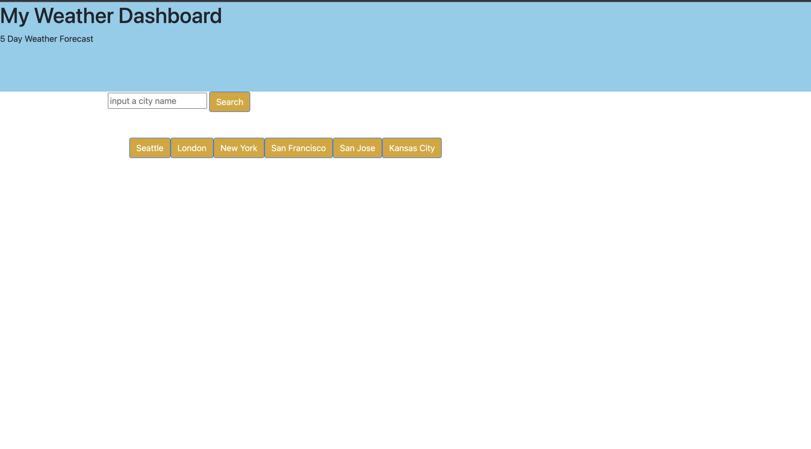
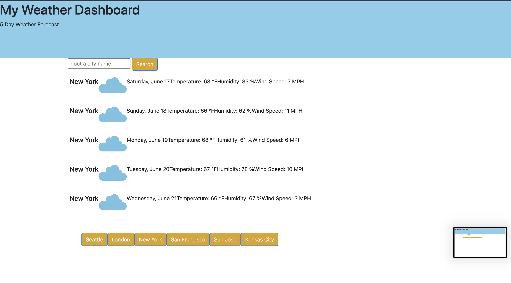

# Michael's Weather App
            
## Badges

## Description
This Application pulls in data from a Weather API and displays the data to the page. Additionally, after searching for a city, that city is saved to local storage and that city can be quickly accessed by clicking on the button corresponding to that city that is generated on the page

## Table of Contents

- [Installation](#installation)
- [Usage](#usage)
- [Credits](#credits)
- [License](#license)

## Usage
This project will be used to have up to date weather information for whichever cities you would like to view

## Credits
I worked on this project with some assistance from my tutor, David. He helped me with the renderForecast function

## License
[MIT](https://choosealicense.com/licenses/mit/)
---

## Questions
[Email](mailto:michaelicampbell8@gmail.com)
[Github](https://www.github.com/mcampb8)
